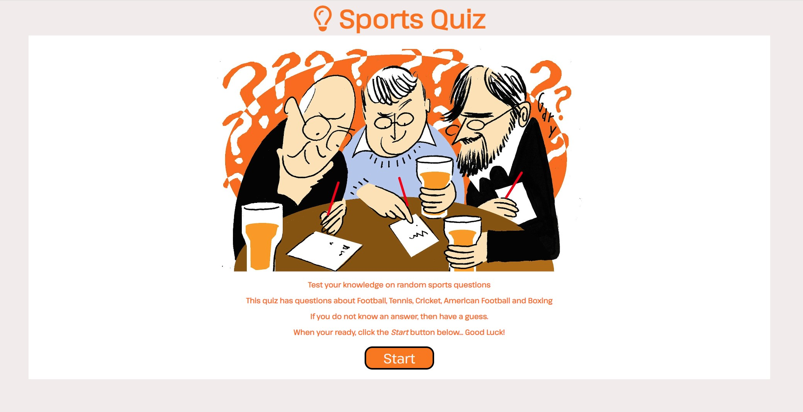
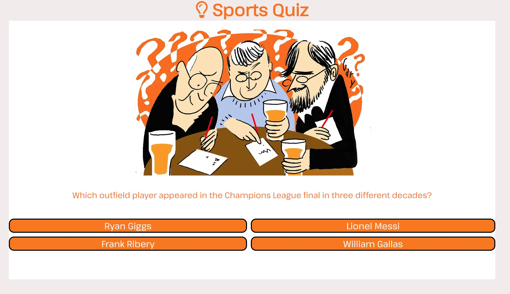
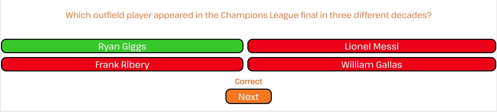
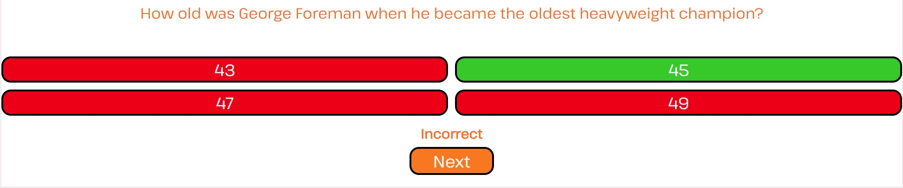
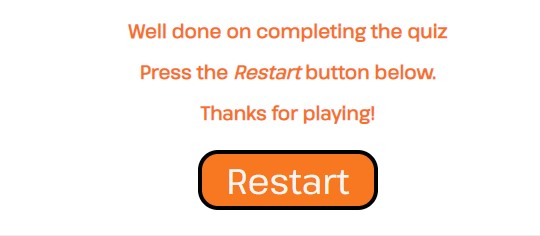
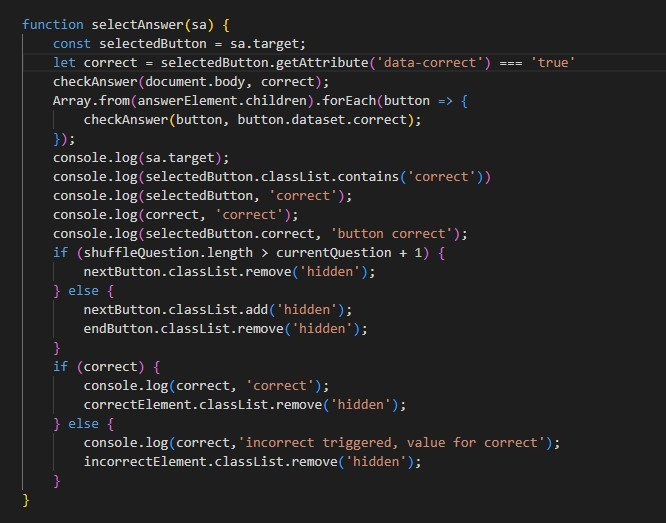
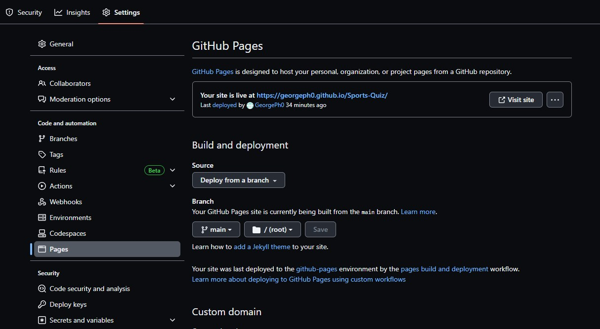

# **Sports Quiz**

## **Introduction**

This is an online quiz made using HTML, CSS and Javascript. The questions in the quiz are sports and consist of Football, Cricket, Tennis and Boxing.

The live website can be [found here](https://georgeph0.github.io/Sports-Quiz/)

## **Table of Contents**

- [Features](#features)
    - [Navbar](#navigation-bar)
    - [Hero Image](#hero-image)
    - [Home Page](#landing-page)
    - [Events](#events-page)
    - [Contact us Page](#contact-page)
    - [Footer](#footer)
- [Technologies](#technologies)
- [Testing](#testing)
    - [Validation](#validator-testing)
- [Bugs](#bugs)
- [Deployment](#deployment)
- [Credits](#credits)

## **Features**

### The Sports quiz Logo and Heading

- At the top of the page throughout the quiz is the logo. The logo is visable so the user can see the name of the game aswell as the image next to it.

### Question Area

- This section is just after selecting the button start. It is the main focus of the page and where the most interaction is.

### Correct answer

- When selecting the correct answer, a piece of text will appear at the bottom of the page to show whether you got the answer correct or incorrect.
This is there so people who do not see colour can also have text to tell them whether it was correct or not.

- The correct answer will appear green.

### Incorrect answer

- When selecting the incorrect answer, the text will appear incorrect. This is similar to the correct answer, showing people who do not see colour that there answer is incorrect.

- The incorrect answers will appear red.

### Restarting the game

- When you finish the quiz you will be shown a message and a restart button.

## **Testing**

### Validator

- HTML

- CSS

- Javascript

## **Bugs**

### Fixed bugs

- Steps on how I fixed my issue:
    - 1. I had an issue of not being able to show the text "Correct" when a user selects an answer.
    - 2. I added in console logs to see if selectedButton and Correct were both defined.
    - 3. I found that correct was undefined and that the class "correct" was being added after the user had clicked the button.
    - 4. The correct answer has a value "data-correct" which I used instead and was able to have the if statement work.

## **Deployment**

This section will show the process of how I deployed my website.

### Github Pages

- The site I used to deploy my website was GitHub. These are the steps I took to deploy my website
    - From the Github repository, click on the settings tab.
    - On the left hand side you will see "Pages". Click on the tab Pages.
    - From there go to the branch section and click the drop down menu and select "main".
    - Click "save" and wait a couple of minutes for the website to deploy.
    - After a few minutes a URL will be available for you to access the site.

link to the deployed website - https://georgeph0.github.io/Sports-Quiz/

## **Credits**

### Images

- All images were sourced through the links below.

    - [Quiz Icon](https://www.dailymail.co.uk/news/article-3513204/Pub-quiz-kings-brainy-barred-happened-JANE-FRYER-joined-team-tournament-Clue-won-t-inviting-back.html)
    - [Football Questions](https://www.goal.com/en-gb/news/best-football-quiz-questions-trivia-answers/1dfwcyp3388zg1lon8wlit8q42#world-cup)
    - [Tennis Questions](https://thesporting.blog/blog/tennis-quiz-questions-with-answers-tennis-trivia-quiz)
    - [Cricket Questions](https://thesporting.blog/blog/cricket-quiz-questions-and-answers-cricket-trivia-quiz)
    - [Boxing Questions](https://www.radiotimes.com/quizzes/pub-quiz-boxing/)
    - [Shuffle Questions](https://dev.to/codebubb/how-to-shuffle-an-array-in-javascript-2ikj)
    - [forEach()](https://www.w3schools.com/jsref/jsref_foreach.asp)
    - [appendChild()](https://www.w3schools.com/jsref/met_node_appendchild.asp)